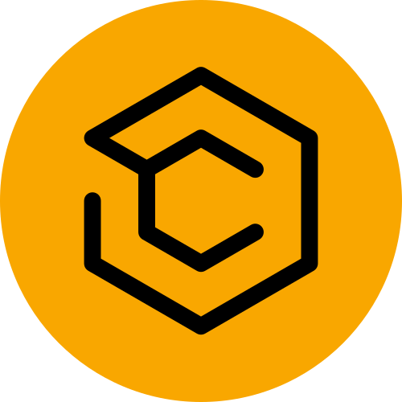

<!-- PROJECT LOGO -->
<br />
<div align="center">
  

  <h3 align="center">Citrine - Blockchain Application</h3>

  <p align="center">
    An Ethereum exchange web application
    <br />
    <a href="https://citrine-eight.vercel.app/">View Demo</a>
  </p>
</div>

<!-- TABLE OF CONTENTS -->
<details>
  <summary>Table of Contents</summary>
  <ol>
    <li>
      <a href="#about-the-project">About The Project</a>
      <ul>
        <li><a href="#built-with">Built With</a></li>
      </ul>
    </li>
    <li>
      <a href="#getting-started">Getting Started</a>
      <ul>
        <li><a href="#prerequisites">Prerequisites</a></li>
        <li><a href="#installation">Installation</a></li>
      </ul>
    </li>
    <li><a href="#contributing">Contributing</a></li>
    <li><a href="#license">License</a></li>
    <li><a href="#contact">Contact</a></li>
    <li><a href="#acknowledgments">Acknowledgments</a></li>
  </ol>
</details>

<!-- ABOUT THE PROJECT -->

## About The Project

![Hero Screen Shot][hero-screenshot] ![Services Screen Shot][services-screenshot] ![Transactions Screen Shot][transactions-screenshot]

This is a fully responsive Ethereum exchange blockchain web application built using web 3.0 technologies, such as MetaMask and Solidity.

Sections included in this web application are:

- **Hero** - section where you can make the transaction
- **Services** - section where the services offered are listed
- **Transactions** - section that shows the transactions carried out

A transaction can contain a keyword that allows you to add a gif thanks to the [Giphy SDK](https://developers.giphy.com/)

<p align="right">(<a href="#top">back to top</a>)</p>

### Built With

- [Next.js](https://nextjs.org/)
- [TypeScript](https://www.typescriptlang.org/)
- [TailwindCSS](https://tailwindcss.com/)
- [Solidity](https://getbootstrap.com)

<p align="right">(<a href="#top">back to top</a>)</p>

<!-- GETTING STARTED -->

## Getting Started

To get a local copy up and running follow these simple example steps.

### Prerequisites

#### Install the lastest version of `NPM`

- npm
  ```sh
  npm install npm@latest -g
  ```

### Installation

1. Get a free Giphy API Key at [https://developers.giphy.com/](https://developers.giphy.com/)
2. Clone the repo
   ```sh
   git clone https://github.com/eliasjz36/citrine.git
   ```
3. Go to client and install NPM packages
   ```sh
   cd client && npm install
   ```
4. Enter your Giphy API Key in a `.env` file
   ```js
   NEXT_PUBLIC_GIPHY_KEY = 'ENTER YOUR API';
   ```

<p align="right">(<a href="#top">back to top</a>)</p>

<!-- CONTRIBUTING -->

## Contributing

Contributions are what make the open source community such an amazing place to learn, inspire, and create. Any contributions you make are **greatly appreciated**.

If you have a suggestion that would make this better, please fork the repo and create a pull request. You can also simply open an issue with the tag "enhancement". Don't forget to give the project a star! Thanks again!

1. Fork the Project
2. Create your Feature Branch (`git checkout -b feature/AmazingFeature`)
3. Commit your Changes (`git commit -m 'Add some AmazingFeature'`)
4. Push to the Branch (`git push origin feature/AmazingFeature`)
5. Open a Pull Request

<p align="right">(<a href="#top">back to top</a>)</p>

<!-- LICENSE -->

## License

Distributed under the MIT License. See `LICENSE.txt` for more information.

<p align="right">(<a href="#top">back to top</a>)</p>

<!-- CONTACT -->

## Contact

Elias Jimenez - [elias-jimenez](https://www.linkedin.com/in/elias-jimenez/) - bseliasjimenez14@gmail.com

Project Link: [https://github.com/eliasjz36/citrine](https://github.com/eliasjz36/citrine)

<p align="right">(<a href="#top">back to top</a>)</p>

<!-- ACKNOWLEDGMENTS -->

## Acknowledgments

- [Eth-Revert-Reason](https://github.com/authereum/eth-revert-reason)
- [React Icons](https://react-icons.github.io/react-icons/search)
- [Ethers](https://docs.ethers.io/v5/)
- [React-Toastify](https://fkhadra.github.io/react-toastify/introduction/)
- [Giphy](https://giphy.com/)
- [Hardhat](https://hardhat.org/)
- [MetaMask](https://metamask.io/)
- [Alchemy](https://www.alchemy.com/)

<p align="right">(<a href="#top">back to top</a>)</p>

<!-- MARKDOWN LINKS & IMAGES -->

[hero-screenshot]: ./client/public/images/hero.png
[services-screenshot]: ./client/public/images/services.png
[transactions-screenshot]: ./client/public/images/transactions.png
